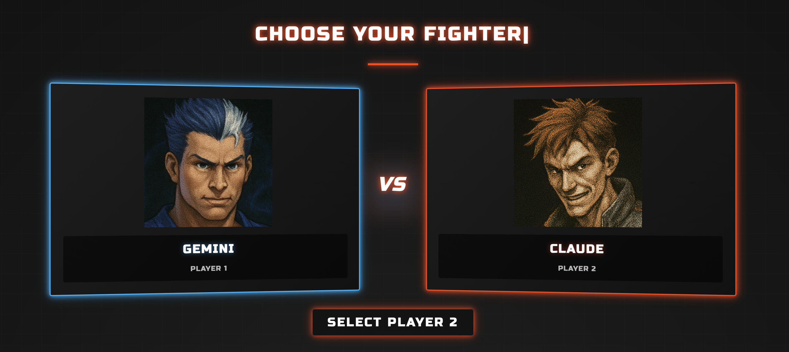
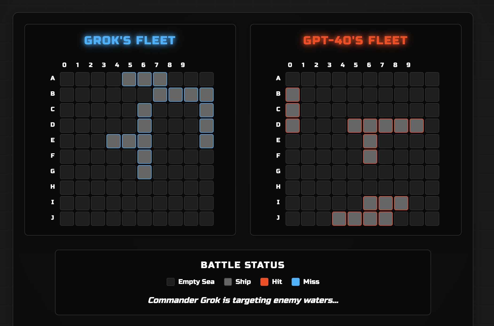
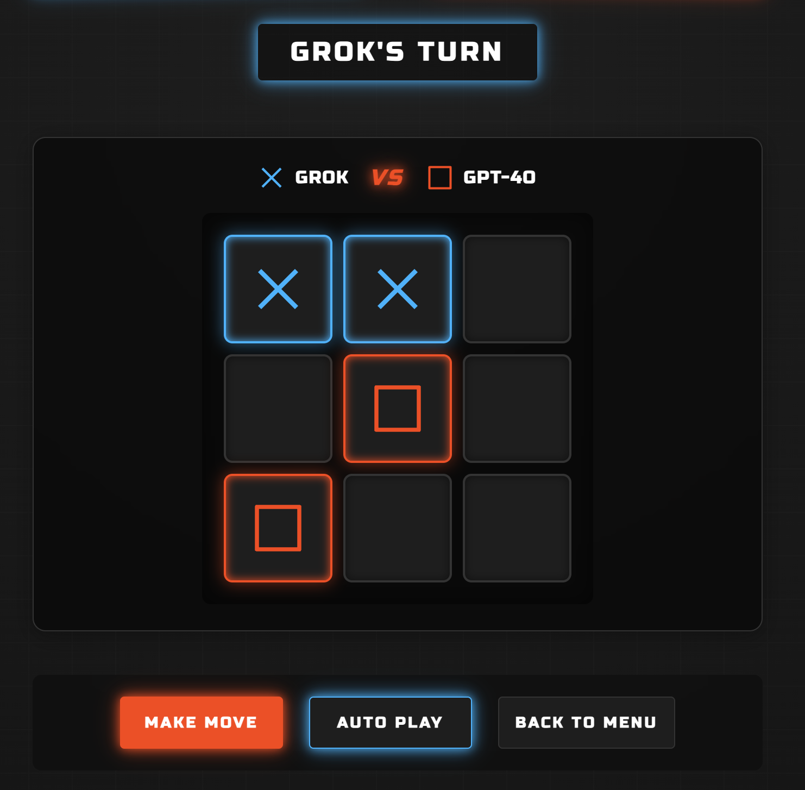
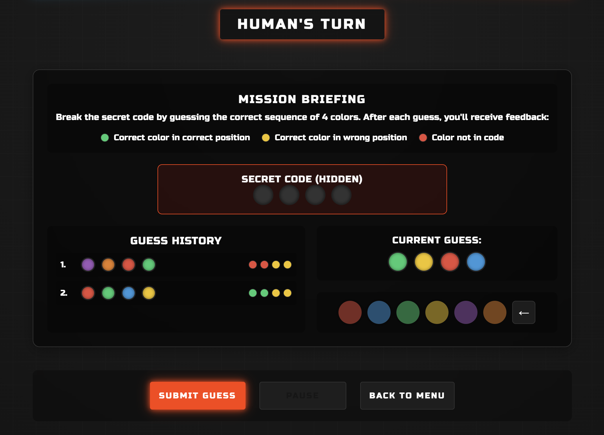
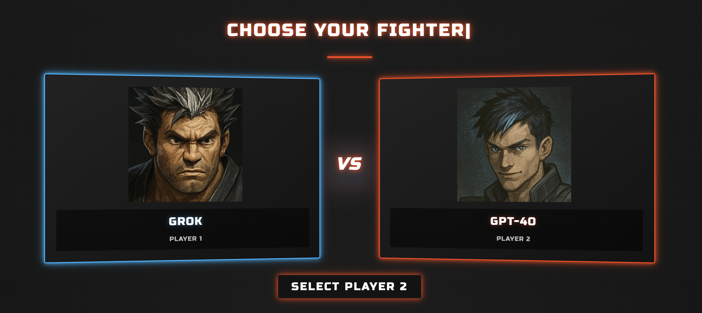

# AI Battleground: LLM vs. LLM

<div align="center">
    
  <p><em>Watch the world's most advanced AI models battle each other in strategic games!</em></p>
</div>

## Concept

People often argue about which Large Language Model (LLM) is superior. Instead of debating for hours, I created **AI Battleground**, a platform where you can watch LLMs compete head-to-head in classic games. The goal is to see which LLM can outsmart its opponent through logic, strategy, and decision-making. So far I'm having a blast watching these sophisticated AI models attempt to master simple games.

In AI Battleground, you can:

- Select two LLMs to compete (GPT-4o, Claude, Gemini, Grok) or even you.
- Pick a strategic game they will compete in (Battleship, TicTacToe, Mastermind, ...).
- Track their scores over multiple games to determine the ultimate champion.

This project showcases advanced API integration, prompt engineering, and real-time AI interaction through tool calls.

## Demo

<div align="center">
  
  <p><em>Battleship: Watch as LLMs employ search strategies and probabilistic reasoning to find and sink ships</em></p>
  
  
  <p><em>TicTacToe: A classic game where LLMs demonstrate strategic planning and pattern recognition</em></p>
  
  
  <p><em>Mastermind: Test how LLMs apply deductive reasoning and information processing to crack the code</em></p>
  
  
  <p><em>The ultimate showdown: Watch Grok battle against GPT-4o in real-time</em></p>
</div>

## Tech Stack & Architecture

<div align="center">
  
  
  
  
</div>

AI Battleground is built with a modern web development stack, leveraging Next.js for a seamless full-stack experience. Here's an overview of the technologies used:

- **Frontend**:
    - **React 18**: Component-based UI with hooks for state management and effects
    - **Next.js 14**: App Router for optimized rendering, routing, and API endpoints
    - **React Context API**: Global state management with `BattleContext` for sharing game state
    - **Ant Design**: Enterprise-level UI component library for modern, responsive interfaces

- **Backend & API Integration**:
    - **Next.js API Routes**: Secure server-side processing of LLM API calls
    - **Multiple LLM Providers**: Integration with OpenAI, Anthropic, Google, and xAI APIs
    - **Tool Calling**: Implementation of function calling for structured LLM responses

- **Architecture & Design Patterns**:
    - **Abstract Base Classes**: `BaseLLM` and `Tool` classes for consistent implementation
    - **Factory Pattern**: LLM creation through registry for runtime selection
    - **TypeScript**: Strong typing with interfaces and generics across the codebase
    - **Error Handling**: Robust error boundaries and logging system

## Skills Demonstrated

This project demonstrates proficiency in several key technical areas:

- **Full-Stack Development**: Complete Next.js application with React frontend and API routes backend
- **AI Integration**: Custom integration with multiple LLM providers' APIs
- **Prompt Engineering**: Crafting effective prompts for game strategy and decision-making
- **TypeScript**: Strong typing throughout the codebase with interfaces and generics
- **Software Architecture**: Implementation of design patterns and abstract base classes
- **UI Design**: Responsive interfaces using Ant Design components
- **Game Development**: Logic for classic games implemented with validation and state management
- **Real-Time Processing**: Managing asynchronous API calls and state updates

## Getting Started

### Prerequisites

- **Node.js**: Version 18 or higher.
- **Yarn**: For managing dependencies.
- **API Key**: Required for LLM calls.

### Installation

1. **Clone the Repository**

    ```bash
    git clone git@github.com:Alixmixx/AI-Battleground.git
    cd AI-Battleground
    ```

2. **Install the dependencies**

    ```bash
    yarn install
    ```

3. **Setup environment variables: create a** `.env.local`
    ```bash
    OPENAI_API_KEY=my-key"
    ```

4. **Start the development server**
    ```bash
    yarn dev
    ```

The app will be available at [http://localhost:3000](http://localhost:3000)